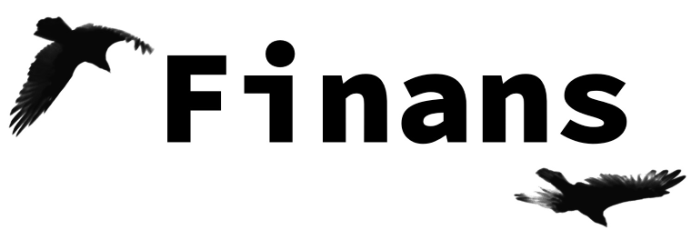

Finans is a personal budgeting framework inspired by YNAB. It is also the swedish word for finance.

Finans is built around a core, with several interfaces:
 * A commandline client
 * In the future, a gui for Windows/Linux/OS X
 * In the future, a android application (both tablet and phone)
 * Possible in the future, a IOS application
